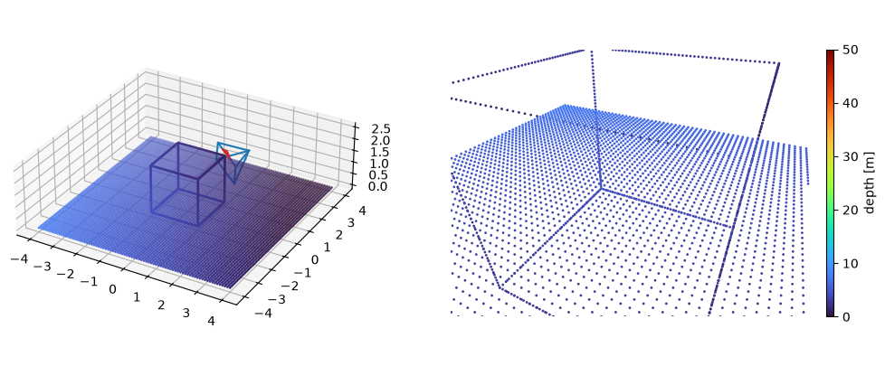
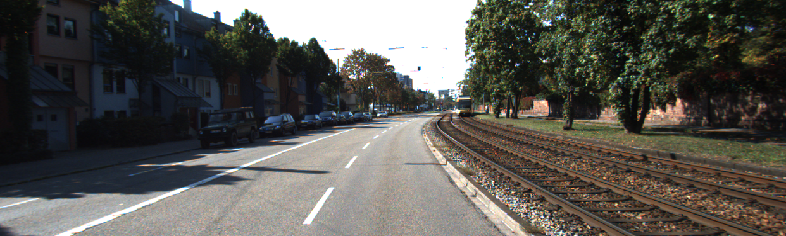
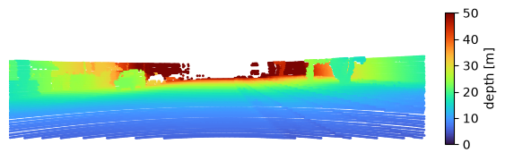
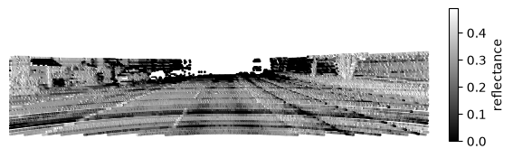

# multisensor-splat

Geometry building blocks for fusing camera and LiDAR data: homogeneous coordinates, rigid transforms, pinhole projection and visualization helpers. They are checked on a synthetic scene first and then on real KITTI data.

## Examples

### Synthetic projection



A cube and a ground grid in 3D (left, with the camera frustum) and the same points projected through a pinhole camera, coloured by depth (right).

*Notebook: [01_synthetic_projection.ipynb](notebooks/01_synthetic_projection.ipynb)*

### KITTI LiDAR overlay



The raw left colour camera image (`image_02`) of KITTI drive `2011_09_26_drive_0001`, frame 0.



The Velodyne scan projected into that camera, coloured by depth. The ground shows up as curved scan rings and the buildings and trees further away are red.



The same projected points coloured by LiDAR reflectance. Road markings and the road surface are separated by material, not by distance.

*Notebook: [02_kitti_lidar_overlay.ipynb](notebooks/02_kitti_lidar_overlay.ipynb)*

## Setup

Requires Python 3.12+ and [uv](https://docs.astral.sh/uv/).

1. **Install the dependencies**

   ```bash
   uv sync
   ```

2. **Download the KITTI sample data (required for notebook 02)**

   The KITTI data is not part of the repository (`data/kitti/` is git-ignored), so notebook 02 fails until you run the download script. It fetches the calibration files plus 10 frames of camera 2, LiDAR and OXTS from drive `2011_09_26_drive_0001`. It uses HTTP range requests rather than the full drive zip, so it transfers only about 25-30 MB.

   ```bash
   uv run python scripts/download_kitti.py --out data/kitti
   ```

   Run it from the repository root so the data lands in `data/kitti`. Other drives and frame ranges are available via `--drive`, `--start` and `--num-frames` (see `--help`). If the public download links have moved, the script prints how to pass a new location via `--base-url`.

3. **Open the notebooks**

   ```bash
   uv run jupyter lab
   ```

   Notebook 01 needs no data. Notebook 02 hardcodes `base_dir` in its first code cell to an absolute path (`C:\Dev\Privat\multisensor-splat\data\kitti`). Change it to the `data/kitti` folder of your checkout.

4. **Run the tests** (optional)

   ```bash
   uv run pytest
   ```
